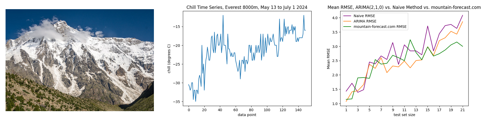

<h1 align="center">scrape-mountain-weather-data 🏔️📊</h1>

  
  

Picture from Wikipedia: https://en.wikipedia.org/wiki/Nanga_Parbat#/media/File:Nanga_Parbat_Rupal_Base_camp,_Gilgit_Baltistan.JPG

> Scripts to scrape weather data from mountains around the world. Data is primarily from [mountain-forecast.com](mountain-forecast.com).

### 🏠 [Homepage](https://github.com/pmwaddell/scrape-mountain-weather-data)

## My Analysis

[Some results of my analysis](scrape_mountain_weather_data/presentation_slides/Time%20Series%20Analysis%20of%20Chill%20Data,%20Everest%20at%208000m.pdf) 
can be found in the scrape_mountain_weather_data/presentation_slides directory.
I conducted a time series analysis of the weather at 8000 m on Mount Everest, and used an ARIMA model to model it.

Other results can be found on my Looker site. At present these include 
an [analysis of chill temperature in the mornings](https://lookerstudio.google.com/reporting/4ff637e7-e6ae-4ba6-aea8-29ba9644274c/page/p_gcdwzk72id) 
and an [analysis of forecast accuracy from mountain-forecast.com](https://lookerstudio.google.com/reporting/67e87d45-2538-4f23-b88c-3118c33e85d6/page/p_e0yqxss9id).

## Setup and Operation

Using BASH, navigate to orca-data-to-db/orca-data-to-db/src/ directory. 
Then, run the command "docker compose --env-file dev.env up", which will start the Docker 
containers for Mage, PostgreSQL, and pgAdmin.

Mage can be accessed from localhost:6789. Running the pipeline fore_to_postgres will scrape
current weather data from the given mountains and elevations on mountain-forecast.com and put the resulting 
data in Postgres. You may need to edit the loader of this pipeline to create the table forecast_data.scraped_
forecasts_final and populate it with initial data, if it doesn't already exist.

The data in Postgres can be accessed via pgAdmin from localhost:8080. The data is at first put into
a "staging" table, and then consolidated into a "final" table containing only one set of records to each
"time issued" from mountain-forecast.com. Data from the "staging" table is accumulated from each scrape 
until it is 3 days old, at which point it is dropped. 

This upserting and dropping should be run automatically via pgAgent (see the tab for pgAgent Jobs below); 
if needed, they can be run as manual queries by the user. These queries can be found in sql_queries_backup.txt.

Note that when the scraped_forecasts_final table is first created, it needs to have the columns mtn_name, 
elevation, local_time_issued and local_time_of_forecast set as primary keys. The command for this can also be found
in sql_queries_backup.txt. Note also that if Autocommit is off, you may need to add COMMIT; after these queries.

The pipelines pg_fore_f_to_csv (for the "final" forecast table), postgres_fore_s_to_csv (for the "staging" forecast table) 
and csv_fore_f_to_pg can be used to save the data in Postgres to a local .csv file  found in src/forecast_data, and to 
load the data from a .csv file in src/forecast_data back into Postgres (under a Schema called loaded_backups) respectively.

To send data to BQ, you need to set up a GCP account and project. Then go into the project and set up a 
Service Account as project owner. Create a Key for this account, download it and place it into the directory
designated folder in docker-compose.yaml (/Documents/secrets/personal-gcp.json by default seems to work).

## How to install pgAgent in the container with Postgres:

see 
https://karatejb.blogspot.com/2020/04/postgresql-pgagent-scheduling-agent.html

and also
https://www.ibm.com/docs/en/z-chatops/1.1.4.x?topic=software-installing-pgagent

To go into a docker container with bash:

$ winpty docker exec -it -u=root scrape-mountain-weather-data-postgres //bin//sh

Then run 

$ apt-get update && apt-get install pgagent

Next, you must connect pgAgent to the Postgres database, which can be done with the command:

\$ usr/bin/pgagent hostaddr=127.0.0.1 port=5432 dbname=postgres user=${POSTGRES_USER} password=${POSTGRES_PASSWORD}

The connection can be checked by 

$ ps -ef |grep pgagent

But you may need to install procps if this doesn't work first:

$ apt-get update && apt-get install procps

Then, must go into pgAdmin and under the tree, expand the data base and click "Extensions".
Then, right click Create > Extension... and under Name type pgagent.
Then simply refresh and there should be a place for pgAgent Jobs at the bottom. 
Make sure you see 'pgagent' and 'plpgsql' under Extensions as well.

Currently, the Dockerfile should be taking care of everything except the last part. 
However, it seems that the user may still need to manually go into the Docker container
and restart pgAgent when firing it back up.

## Author

👤 **Peter Waddell**

* Website: https://github.com/pmwaddell
* Github: [@pmwaddell](https://github.com/pmwaddell)
* LinkedIn: [@https:\/\/www.linkedin.com\/in\/peter-waddell-ph-d-00b95265\/](https://linkedin.com/in/https:\/\/www.linkedin.com\/in\/peter-waddell-ph-d-00b95265\/)

## Show your support

Give a ⭐️ if this project helped you!

## 📝 License

Copyright © 2024 [Peter Waddell](https://github.com/pmwaddell). 
This project is [MIT](https://www.mit.edu/~amini/LICENSE.md) licensed.
